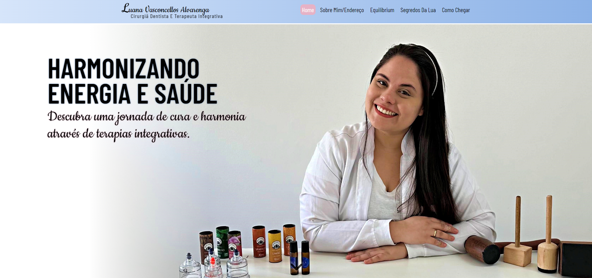
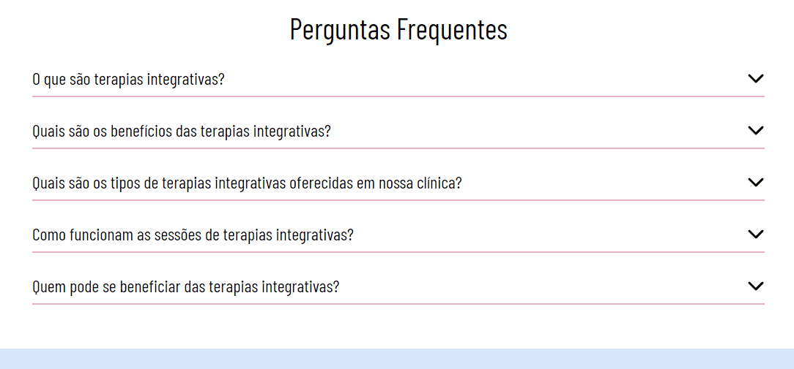
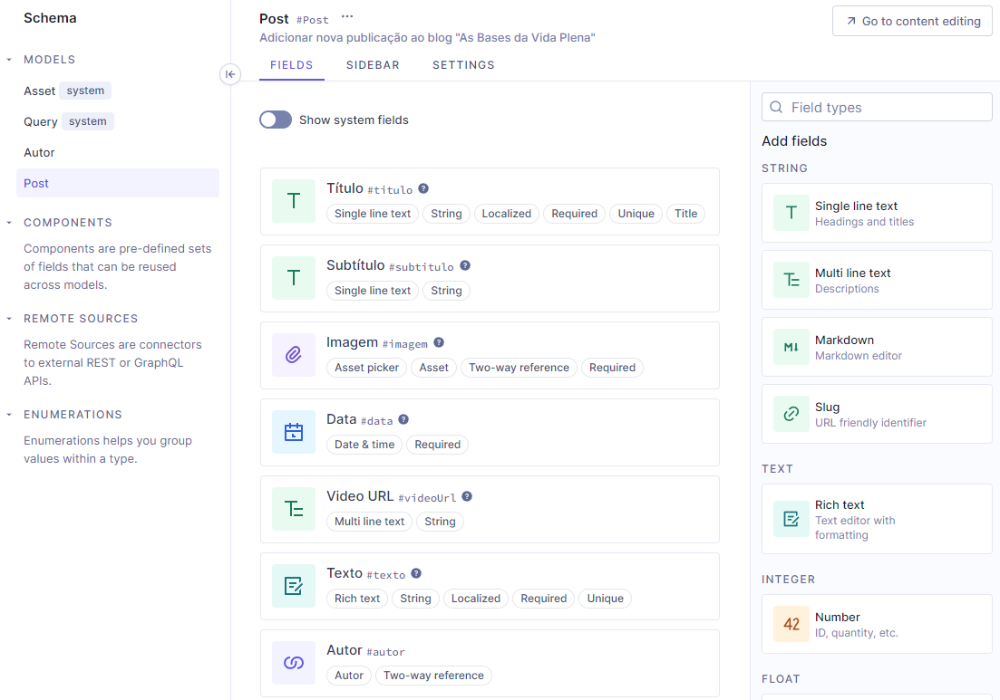
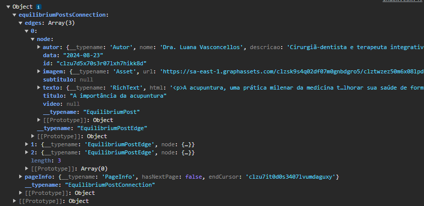

# Dra. Lorenza Arruda Personal Website

🧾✍ This is a freelancer project using React | TypeScript | Styled-components | GraphQL

[Click here to view the project in your web browser](https://luana-integrative-therapies.vercel.app).



## Summary

-  [General Vision](#general-vision)
   -  [Objective](#objective)
   -  [Screenshots](#screenshots)
-  [My Process](#my-process)
   -  [Technologies Used](#technologies-used)
   -  [Project Functionality](#project-functionality)
   -  [How to Run the Project](#how-to-run-the-project)
   -  [Continuous Development](#continuous-development)
   -  [Useful Resources](#useful-resources)
-  [Author](#author)

# General Vision

## Objective

-  To create a website that permits the user to know more about Dra. Luana and her therapies.
-  To use swipers to show the patients commentaries and therapies used by Dra.Luana.
-  To create a call to the users to connect to the Dra. Luana by her social midia.
-  To create a FAQs section.
-  To create the contacts and address section.
-  To create a blog, that permits the client to add new posts using hygraph, and configured with GraphQL.
-  To create two subsections to acess "Equilibrium" and "Segredos da Lua" brands.

## Screenshots

### Browser view


### Blogs

Here the posts were created just by test, therefore their content were not revised by a professional in the area.


### Mobile view


# My Process

## Technologies Used

-  [React](https://react.dev) - The cornerstone of my development toolkit, empowering me to craft reusable components that form the foundation of robust applications and stunning web interfaces.
-  [GraphQL](https://graphql.org) - A query language for your API that enables precise and efficient data fetching, allowing clients to request exactly the data they need and nothing more, thus optimizing performance and reducing over-fetching.
-  [Swiper](https://swiperjs.com) - A modern mobile touch slider library that provides a seamless and highly customizable carousel experience, perfect for implementing responsive slideshows and galleries in web applications.
-  [Styled-Components](https://styled-components.com) - A popular CSS-in-JS library that brings the full power of JavaScript to styling, enabling the creation of component-level styles with ease, ensuring modular and maintainable code.
-  [Typescript](https://www.typescriptlang.org) - A JavaScript superset that enhances code quality, minimizes bugs, and boosts security.

## Project Functionality

The focus on this project is to create a personal webpage about Dra. Luana's therapies and services. Therefore, adding a blog functionality that shows a little more about her therapies and extra content.

### Variables

To performs the project and to make easy to maintain and scale, the variables were maintained into a unique file. That way, it's necessary just to change a single line to update all project in the styles, personal data, links, etc.

```ts
export const fontSize: IFontSize = {
   smallSize: "2rem",
   basicSize: "2.4rem",
   mediumSize: "3rem",
   largeSize: "3.5rem",
   extraLargeSize: "4rem",
};

export const fontWeight: IFontWeight = {
   thin: "300",
   medium: "400",
   semiBold: "500",
   bold: "600",
};

export const sectionsTheme: ITheme[] = [
   {
      id: "default",
      primaryColor: "#D6E5FA",
      secondaryColor: "#E6B2C6",
      tertiaryColor: "#8cb2e7",
      textColor: "#000000",
      secondaryTextColor: "#ffffff",
      shadowColor: "#c72a66",
      backgroundColor: "#ffffff",
   },
   // Other items
];
```

### Routes

All pages used a footer and header component, that guide users between pages using [React-Router-Dom](https://reactrouter.com/en/main). Every route and the name of each route was added into a json file to maintain it more easier. Then, a map methos was created to list each route.

```tsx
<Link to={`/${navButton.link}`}>
   <li className="link">{navButton.name}</li>
</Link>
```

In addition of these components, these are the rest of the app sections:

### 1. Home section

The home section is divided by:

1. Hero
2. Therapies Benefits (The benefits of the treatments in summary)
3. Therapeutic Care (How the treatments work)
4. Patients depositions

Here it was used a carousel libraray called [Swiper js](https://swiperjs.com), that leaded with the organization of the content into a carousel.

```tsx
<Swiper
   modules={[Pagination, Navigation, Autoplay]}
   loop={true}
   className="swiper"
   spaceBetween={spaceBetween ? spaceBetween : 50}
   slidesPerView={slidesPerView}
   navigation
   pagination={{
      dynamicBullets: true,
      clickable: true,
   }}
   autoplay={{
      disableOnInteraction: false,
   }}
>
   {info.map((item) => (
      <SwiperSlide key={item.id} className="slide">
         <FontAwesomeIcon icon={faQuoteLeft} className="slideIcon" />
         <p className="slideText">"{item.deposition}"</p>
         <h3 className="itemDescription">{item.name}</h3>
      </SwiperSlide>
   ))}
</Swiper>
```

The Swiper component is a container of the slides, that means, each text or image used here is a slide. In our case, we used the depositions.
In short, the Swiper has some props that defines how the carousel will behave, as

-  slidesPerView: the number of slides showed into the UI
-  navigation: buttons to go to the next or previous slide
-  loop: to return to the first slide when reach to the last one
-  modules: swiper extra functionalities, to personalize its behavior.

Learn more reading the docs: [Swiper js](https://swiperjs.com)

5. A call to action section to guide user into instagram and Whatsapp
6. FAQs

Into FAQs section, it was used a json array that contains the FAQ and its answer. To bring a better visualization of the content and bring a smooth animation of the answer oppening when the FAQ is clicked, the [React Collapse](https://github.com/nkbt/react-collapse) was used.

```tsx
<li className="faq">
   <p className="question">{faq.question}</p>
   <Collapse isOpened={questionSelected === faq.question}>
      {faq.answer}
   </Collapse>
</li>
```

It was easy to implement. It's just necessary to add a boolean value into `isOpened` prop. When it's true, it'll open, when it's false it'll close. It was used a state that changes between true and false when clicked or when the user click on another question.

To add a smooth animation, it's necessary to add a transition to the Collapse component with this class:

```tsx
const Container = styled.div`
   .ReactCollapse--collapse {
      transition: height 0.5s ease;
   }

   /* Other styles */
`;
```

With this, the height will change smoothly when the Collapse container be opened. It's also posible to add some custom properties, as custom font-size, font-weight, padding, margin, etc. It's a common element. Try it out and read the docs, [React Collapse](https://github.com/nkbt/react-collapse), it's really simple to implement.

### Result:



### 2. About me section

Here there is nothing complex to understand, just simple sintaxes and styles. Here it's the section to tell more about Luana as person and professional and show her clinic address.

### 3. Equilibrium and Segredos da Lua blogs

Both of these sections as two focus, the blog functionality and the Therapies functionality. Both of them were created and maintain with Hygraph and GraphQl, that way, let's explain each of them in turn.

### [Hygraph](https://hygraph.com)

The blogs functionalities was created using hygraph and GraphQL. Hygraph is a headless CMS (Content Management System) that allows developers to create and manage content through a GraphQL API. It provides a flexible and great way to build content models and retrieve data, making it perfect for projects like blogs. With it, it's possible to define content types (e.g., posts, authors), structure your data, and then use the GraphQL API to fetch this data in your front-end applications. This approach separates content management from the front-end, giving you the freedom to design and develop without constraints. It's particularly useful for blogs as it allows for easy content updates, scalability, and a smooth integration with frameworks as we are using React here.



When the user defines the project schema, in the content window the client can add new posts and authors to your blog. After that, we just need to configure it in the React application using [Apollo-Client](https://www.apollographql.com/docs/react/), as recommended by Hygraph docs.

Apollo Client is a popular state management library that simplifies working with GraphQL APIs in JavaScript applications, especially React. It provides tools for querying, caching, and managing data fetched from a GraphQL API, such as Hygraph, that we are using here.

Using Apollo Client with Hygraph is recommended because it allows us to efficiently handle GraphQL queries and mutations, manage the state of the application, and cache data locally to reduce unnecessary network requests. Apollo Client also offers features like automatic query updates, pagination, and error handling, making it easier to integrate and manage the data from Hygraph in the React.

#### Configuration

```ts
import { ApolloClient, HttpLink, InMemoryCache, gql } from "@apollo/client";

export const client = new ApolloClient({
   uri: import.meta.env.VITE_HYGRAPH_API_URL,
   cache: new InMemoryCache(),
   link: new HttpLink({
      uri: import.meta.env.VITE_HYGRAPH_API_URL,
      headers: {
         Authorization: `Bearer ${import.meta.env.VITE_HYGRAPH_API_TOKEN}`,
      },
   }),
});
```

A new client is created using ApolloClient and it is used to wrap the components that will use it, using ApolloProvider.

```tsx
ReactDOM.createRoot(document.getElementById("root")!).render(
   <React.StrictMode>
      <GlobalStyles />
      <ApolloProvider client={client}>
         <App />
      </ApolloProvider>
   </React.StrictMode>
);
```

The hygraph give us sensitive data, as the API URL access from your data and a security token. That way, it is necessary to configure a `.env` file to aims these data, using it, for example that way: `import.meta.env.VITE_HYGRAPH_API_URL`. Vite automatically configure .env in the project, so don't worry to configure it if you are using your React app with it.

Apollo-client requires the uri(the API URL), the cache and the headers, that is the security token created in the hygraph website. Without the token, we can't access the API data.

After that, it's necessary to configure the GraphQL query code. It's really similar to a JSON file, but without quotes and for sure it has more details, but here is really simple:

```ts
export const GET_EQUILIBRIUM_POST_BY_ID_QUERY = gql`
   query GetAllEquilibriumPosts($after: String, $first: Int!) {
      equilibriumPostsConnection(after: $after, first: $first) {
         pageInfo {
            hasNextPage
            endCursor
         }
         edges {
            node {
               id
               titulo
               subtitulo
               data
               imagem {
                  url
               }
               video
               texto {
                  html
               }
               autor {
                  nome
                  descricao
                  avatar {
                     url
                  }
                  cro
               }
            }
         }
      }
   }
`;
```

That way, our API return will be available as:



Finally, we just need to configure the components that need these data to show them into the screen using `useQuery` hook, made available by Apollo-Client.

```tsx
const { loading, error, data } = useQuery(GET_EQUILIBRIUM_POST_BY_ID_QUERY);
```

It's possible to configure the component to render specific messages when the data is loading and when occurs an error.

The post text is returned as a string in html format. That way, it's necessary to use [html-react-parser](https://www.npmjs.com/package/html-react-parser) library that converts an HTML string to one or more React elements.

The unique difference between therapies and blog sections is that the content is showed using the Swiper, as showed before in the Patients Depositions component.

The `pageInfo` into the GraphQl query it's necessary to fetch more data, because with it we know if there is a nextPage and what was the id of the last element of our API list, to fetch for the next bank data after this id.

### How to execute the project

-  The project was created with [React-Vite](https://vitejs.dev).

-  To download the project, open the terminal in the VSCode and write the dependencies code installations: **npm install**

The package.json file already contains the version of the library in its data, so all the libraries used in this project will be installed on your machine in the same way. But if you are interested in how to download, use, or learn more about the libraries that were used in my code, as well as the localStorage, access the links in the [Usefull resources](#usefull-resources).

-  To run the project in the browser, it is necessary to activate **NPM Scripts** in the three dots next to the EXPOLORER of VSCode or to write on the terminal `npm run dev`.


-  Then, in the bottom-left window of **NPM SCRIPTS**, click on the **run** button next to package.json/dev vite.


-  Finally, in the terminal, keep the **localhost** link will appear where the project will be running in your browser. Hover over it and click **Follow link**, or press the ctrl button on your keyboard and click on the **localhost**, and the page will open in your default browser.


There are other ways to open the project, but that form it is the one that I'm used to use.

### Continuous development

That was one of many freelancer's project that I'm going to create. It's really satisfactory to create these projects, because every time we learn something new. I've already worked with Hygraph and GraphQL before, but I've leaned this time to use the pagination system, to feach more content when the current page have already fetched all content, and even more. I could add new error verifications to maintain the project without errors.

To implement new methods to bring a better style, smooth animations and better functionalities to my project I've used React-Collapse, Swiper and [html-react-parser](https://www.npmjs.com/package/html-react-parser). Despite some of these beeing simple and really objetives libraries, they make our code development easier and faster. The phrase "don't reinvent the wheel" really make sense now, because some of these functionalities it's not easy to implement, but with these libraries the logic is simpler.

### Useful Resources

-  [Hygraph](https://hygraph.com/docs): A headless CMS that enables flexible content management through a GraphQL API, allowing developers to create structured content models and seamlessly integrate dynamic content into applications. -[html-react-parser](https://www.npmjs.com/package/html-react-parser): A utility for parsing and rendering HTML strings as React components, providing a safe and convenient way to integrate dynamic HTML content within React applications.
-  [Font-awesome-icons](https://fontawesome.com) - A straightforward React library for easily integrating a wide range of icons into projects.
-  [React Collapse](https://github.com/nkbt/react-collapse) - A lightweight component for managing collapsible sections in React, providing a way to hide and reveal content dynamically while ensuring smooth animations and a minimal footprint for applications.

## Author

-  GitHub - [Felipe Santiago Morais](https://github.com/SantiagoMorais)
-  Linkedin - [Felipe Santiago](https://www.linkedin.com/in/felipe-santiago-873025288/)
-  Instagram - [@felipe.santiago.morais](https://www.instagram.com/felipe.santiago.morais)
-  Email - <a href="mailto:contatofelipesantiago@gmail.com" target="blank">contatofelipesantiago@gmail.com</a>
